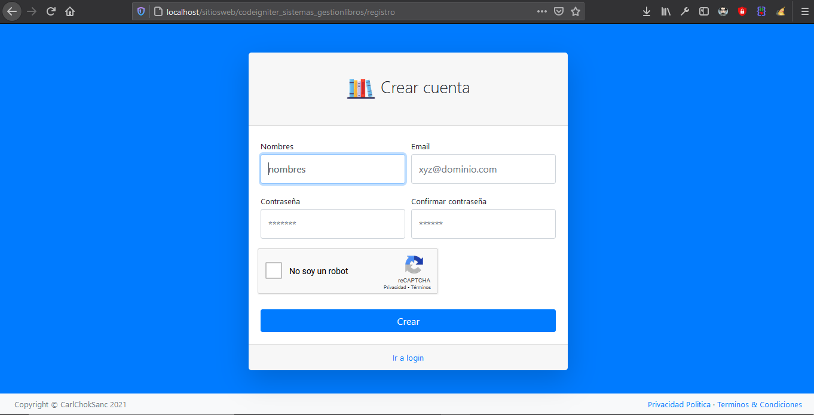
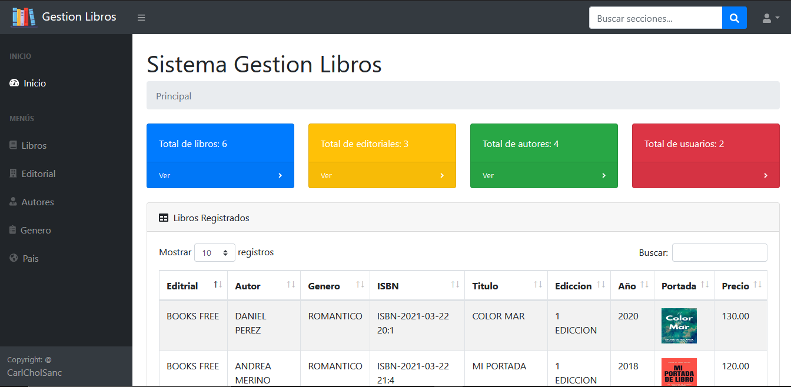
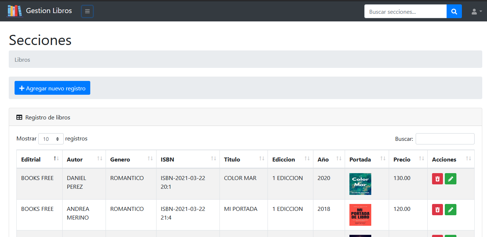
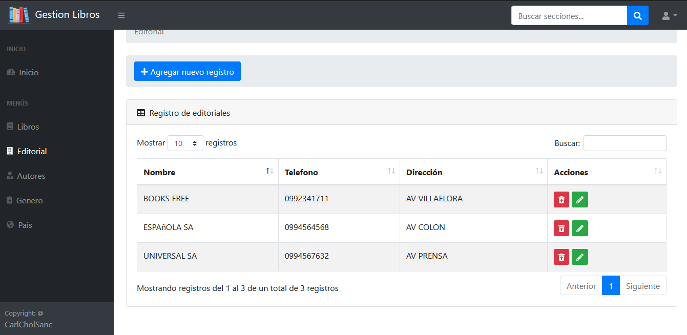

# CODEIGNITER 3

     

### Sistema de gestion de libros.

#### Repositorio:

`$ https://github.com/harlericho/codeigniter_sistemas_gestionlibros.git`

### Pasos para instalarlo en tu servidor local.
    1. - Clonar el repositorio en tu servidor local root o var/html/www.
    2. - Importar la base de datos en tu gestor gráfico de MYSQL.
    3. - Configurar la ruta del proyecto.
            application/config/config.php:    
            <?php
            $config['base_url'] = 'http://localhost/codeigniter_sistemas_gestionlibros';
            ?>
    4. - Configurar la conexión de la base de datos.
            application/config/database.php
                'hostname' => 'localhost',
                'username' => 'root',
                'password' => 'root',
                'database' => 'codeigniter_crudbasico_nombres'
# codeigniter_sistemas_gestionlibros

+ Inicio

+ Principal

+ Crud

+ Secciones

# Github: @CarlChokSanc

## The MIT License (MIT)

### Este programa o sistema puede ser tomado como guia o enseñanza para sus futuros  proyectos.
Copyright (c) 2021 harlericho
